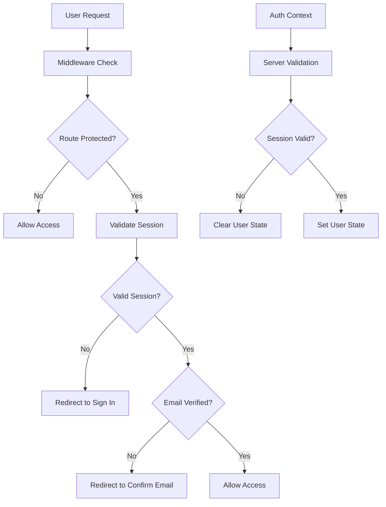

# Design Document

## Overview

This design addresses a critical authentication bypass vulnerability where users are being automatically routed into the application without proper authentication. The root cause appears to be in the authentication context initialization and middleware configuration that allows unauthenticated access to protected routes.

Based on the code analysis, the primary issues are:

1. **Demo Mode Security Flaw**: The authentication context enables demo mode in development environments without proper validation
2. **Middleware Bypass**: The middleware configuration excludes API routes but may not be properly protecting all application routes
3. **Client-Side Auth Logic**: The main page redirects to dashboard based on user state without server-side validation
4. **Session Validation Gaps**: The auth context may be setting user state without proper server-side session validation

## Architecture

### Authentication Flow Security Model



### Security Layers

1. **Server-Side Middleware**: First line of defense at the edge
2. **Auth Context Validation**: Client-side state management with server validation
3. **Route Guards**: Component-level protection for sensitive areas
4. **API Endpoint Protection**: Server-side validation for all API calls

## Components and Interfaces

### Enhanced Middleware

**Purpose**: Provide comprehensive route protection with proper session validation

**Key Features**:
- Strict route protection configuration
- Server-side session validation for all protected routes
- Proper demo mode handling with security controls
- Comprehensive logging for security auditing

**Interface**:
```typescript
interface MiddlewareConfig {
  protectedRoutes: string[]
  publicRoutes: string[]
  authRoutes: string[]
  unverifiedAllowedRoutes: string[]
}

interface AuthValidationResult {
  isAuthenticated: boolean
  isEmailVerified: boolean
  shouldRedirectToSignIn: boolean
  shouldRedirectToConfirmEmail: boolean
  securityAlerts: string[]
}
```

### Secure Auth Context

**Purpose**: Provide client-side authentication state with mandatory server validation

**Key Features**:
- Mandatory server-side session validation on initialization
- Secure demo mode with explicit production controls
- Session consistency validation
- Automatic session refresh with fallback to sign-out

**Interface**:
```typescript
interface SecureAuthContext {
  user: User | null
  loading: boolean
  isAuthenticated: boolean
  isEmailVerified: boolean
  sessionValid: boolean
  securityLevel: 'secure' | 'degraded' | 'compromised'
}
```

### Route Protection Service

**Purpose**: Centralized route protection logic with consistent security policies

**Key Features**:
- Centralized route classification
- Security policy enforcement
- Audit logging for access attempts
- Fallback security measures

**Interface**:
```typescript
interface RouteProtectionService {
  isRouteProtected(path: string): boolean
  validateAccess(user: User | null, path: string): AccessResult
  logSecurityEvent(event: SecurityEvent): void
}
```

## Data Models

### Security Event Model

```typescript
interface SecurityEvent {
  id: string
  timestamp: Date
  type: 'auth_bypass_attempt' | 'invalid_session' | 'unauthorized_access'
  userId?: string
  route: string
  userAgent: string
  ipAddress: string
  details: Record<string, any>
}
```

### Session Validation Model

```typescript
interface SessionValidation {
  isValid: boolean
  userId: string
  expiresAt: Date
  securityFingerprint: string
  validationErrors: string[]
}
```

## Error Handling

### Authentication Bypass Detection

1. **Immediate Response**: Block access and redirect to sign-in
2. **Security Logging**: Log all bypass attempts with full context
3. **Session Termination**: Clear all client-side authentication state
4. **User Notification**: Inform user of security action taken

### Session Validation Failures

1. **Graceful Degradation**: Attempt session refresh before termination
2. **Fallback Security**: Default to most restrictive access level
3. **User Experience**: Provide clear messaging about authentication requirements
4. **Audit Trail**: Maintain comprehensive logs for security analysis

### Demo Mode Security

1. **Environment Validation**: Strict controls on demo mode availability
2. **Production Protection**: Explicit configuration required for production demo mode
3. **Data Isolation**: Ensure demo data cannot access real user data
4. **Session Separation**: Prevent demo sessions from accessing protected resources

## Testing Strategy

### Security Testing

1. **Authentication Bypass Tests**: Verify all protected routes require authentication
2. **Session Validation Tests**: Test session expiration and refresh scenarios
3. **Demo Mode Security Tests**: Verify demo mode cannot access protected resources
4. **Middleware Protection Tests**: Test middleware blocks unauthorized access

### Integration Testing

1. **End-to-End Auth Flow**: Test complete authentication journey
2. **Route Protection Integration**: Verify middleware and context work together
3. **Cross-Browser Compatibility**: Test authentication across different browsers
4. **Mobile Authentication**: Test authentication on mobile devices

### Performance Testing

1. **Middleware Performance**: Ensure security checks don't impact performance
2. **Session Validation Speed**: Test session validation response times
3. **Concurrent User Testing**: Test authentication under load
4. **Memory Usage**: Monitor authentication context memory consumption

## Implementation Phases

### Phase 1: Critical Security Fixes (Immediate)

1. **Disable Automatic Demo Mode**: Remove automatic demo mode activation
2. **Strengthen Middleware**: Add mandatory authentication checks for all protected routes
3. **Server-Side Validation**: Ensure all auth context initialization validates with server
4. **Emergency Logging**: Add comprehensive security event logging

### Phase 2: Enhanced Security Controls (Short-term)

1. **Route Protection Service**: Implement centralized route protection
2. **Session Security**: Add session fingerprinting and validation
3. **Security Monitoring**: Implement real-time security event monitoring
4. **User Security Dashboard**: Provide users visibility into their security status

### Phase 3: Advanced Security Features (Medium-term)

1. **Multi-Factor Authentication**: Add optional MFA for enhanced security
2. **Device Management**: Allow users to manage authenticated devices
3. **Security Analytics**: Implement security pattern analysis
4. **Compliance Features**: Add features for security compliance requirements

## Security Considerations

### Immediate Security Measures

1. **Force Re-authentication**: Clear all existing sessions to ensure clean state
2. **Audit All Access**: Log every route access attempt for security analysis
3. **Disable Demo Mode**: Temporarily disable demo mode until security is verified
4. **Emergency Monitoring**: Implement immediate alerting for security events

### Long-term Security Strategy

1. **Zero Trust Architecture**: Assume no request is trusted without validation
2. **Defense in Depth**: Multiple layers of security validation
3. **Continuous Monitoring**: Real-time security event analysis
4. **Regular Security Audits**: Periodic comprehensive security reviews

### Compliance and Privacy

1. **Data Protection**: Ensure authentication logs comply with privacy regulations
2. **User Consent**: Obtain proper consent for security monitoring
3. **Data Retention**: Implement appropriate retention policies for security logs
4. **Incident Response**: Establish procedures for security incident handling